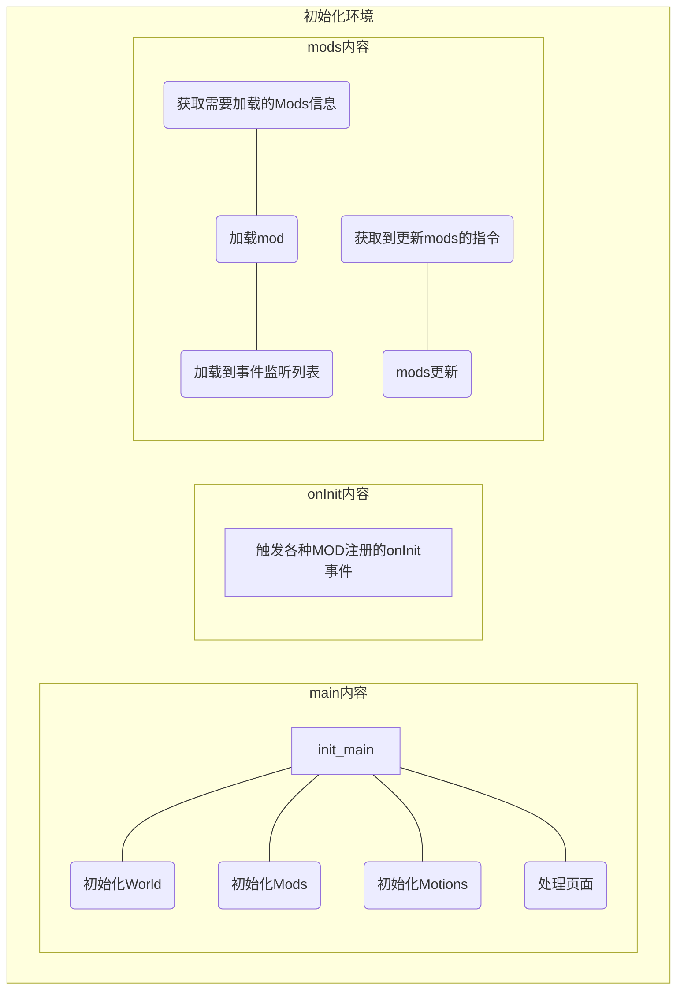

# Cross World

在一个开放的世界中漫游、聊天。

类似游戏：Minecraft、VR Chat

## 整体设计

1. 用户操作
   1. 指定世界`World`，用用户名、密码登录，并且在登录时可以指定`TAG`
   2. 用户被带入这个世界
      1. 如果指定的`TAG`存在，那么就传送到`TAG`旁边
      2. 如果不存在，那么就随机传送，并且可以放置这个`TAG`到指定位置
   3. 用户接收世界信息
      1. 连接`WebSocket`
      2. 下载地图，查找当前区块的附近一共9个区块的信息，称为`附近区块`
      3. 接收附近区块内所有块的动态改变信息
      4. 接收附近区块内用户的所有操作
2. 用户形象
   1. 默认形象：胶囊/球（暂定？）
   2. 上传模型改变形象
   3. 跳起可以1.5格高，蹲下变成1格高
3. 模型（暂时无）
   1. 用户可以上传自定义模型（不允许过大）
   2. 静态模型可以放在地图内
   3. 给自己加上动态模型（有难度）
4. 地形
   1. 地形单位为“实体”，按照摆放位置分组
   2. 初始地形为三层
5. 动作操作
   1. W/S/A/D/Shift/Space移动、跳跃、潜伏
   2. 触屏玩家用摇杆和十字星/点击（参考MC）
   3. 玩家的所有操作反映在本地的世界渲染，也上传世界
   4. 操作按照动作帧处理
   5. 动作帧
      1. 用户位置（由用户本地计算得出）
      2. 摄像头状态
      3. 用户实体
6. `TAG`
   1. 每一个`TAG`就是一个留言板/聊天室
   2. 关注的`TAG`可以接收消息
7. 权限
   1. 分级
      1. 游客
      2. 注册者
      3. 玩家
      4. 管理员
      5. 站长
   2. 按照编号分配等级
   3. 权限管理
      1. 只有上层MOD需要校验权限
8. MODS
   1. MOD加载系统
      1. 通过`websocket`服务器传输mod，游戏整体静态文件不变
      2. 当然也可以打包在静态文件中
      3. mod可以动态加载
      4. mod必须前后端配合
   2. MOD的执行
      1. 后端
         1. 流水线结构：按照序列执行
         2. 每一个环节都可以接触到服务器对每个用户的往来`ws`信息
         3. 每个环节接触到的是上一个环节的数据
      2. 前端
         1. 格式：module，可import
         2. 依赖
            1. 用`import`方式加载依赖
            2. catch
         3. 包含：
            1. 钩子：直接监听事件
               1. on load
               2. on receive
               3. on render
               4. on keydown
               5. ...
            2. 版本...等信息
      3. 文件
         1. `mod/xxx/frontend/xxx.mjs`
         2. `mod/xxx/backend/xxx.mjs`
   3. 基础MOD
      1. `TAG`MOD
         1. `TAG`可以作为MOD存在
      2. 地形MOD
         1. 读取到用户对地形的改变
         2. 改变地形
         3. 定时保存地形
      3. 操作MOD
         1. 读取用户的操作
         2. 操作广播
      4. 权限MOD
   4. 生存MOD（暂无）
      1. 可以对玩家造成伤害
      2. 被杀死的玩家所增加的地形被消除
   5. 公共`TAG`（暂无）
      1. 在公共`TAG`发消息，所有人都会收到
   6. 时间MOD
      1. 提供两个移动的主光源
         1. 太阳
         2. 月亮
      2. 时间系统

### 运行流程

**前端**：

## 开发流程

1. 可行性验证
   - [ ] 3D
     - [x] WebGL
   - [ ] 基础
     - [x] ES6动态加载模块
     - [ ] ~~WebPack~~
   - [ ] 控制部分
     - [x] 监控按键
     - [x] 监控鼠标
     - [x] 控制全屏
     - [x] 指针锁定
     - [ ] 摄像头控制
   - [x] `WebSocket`
   - [x] 构建场景
     - [x] 设置光照
     - [x] 增加实体
2. 前端
   - [ ] 项目框架
     - [x] 图形渲染框架
     - [x] 事件监听框架
     - [ ] 动作控制框架
     - [ ] MOD加载框架
   - [ ] 构建场景
   - [ ] MOD系统
     - [ ] MOD BASE
       - [ ] 
3. 后端
   - [ ] NodeJS框架
   - [ ] `WebSocket`
   - [ ] MOD系统

